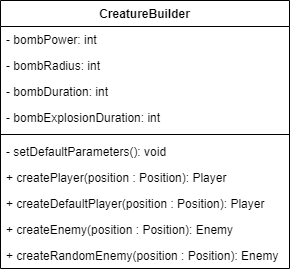

# LPOO_T5G6 - BomberMan

This recreation of BomberMan, is intended to be similar to the one play all around internet. 
However, it has some changes. The main purpose is surviving through all the game extent. 
The only way to win is to break down all the breakable walls and, after that, kill all the surviving enemies.

Project developed by [André Pereira](https://github.com/Andrepereira2001), [Emanuel Pessoa](https://github.com/EmanuelPogssoa) e [Matilde Oliveira](https://github.com/maildejoliveira).

---

## Implemented Features

### Menu

The program starts by presenting a menu that has two possible options. 
By using the arrow up and down keys the user may choose between **START** and **EXIT**. 
By pressing _ENTER_ in the first one, it will open the game window and initiate the game. 
On the contrary, pressing _ENTER_ when EXIT selected the program will close the terminal and stop executing.

Other Menu related issues, rely on the fact that only choosing the option EXIT will finish the execution. 
When the game is being played, to quit and go back to the menu you should press _Q_. 
If you win or loose you will be redirected to a result menu and you should press _ENTER_ again to go back to the main Menu.

### Game

**Player Movement** - the player moves around the field when the arrow keys are pressed. It is responsible to place bombs, by pressing _SPACE_, that will able him to destroy walls and kill enemies. 
Note that only the bombs have this ability. 

**Walls** - there are two different types of walls:

- **Breakable**: these are destructible walls that are affected by the explosions of the bombs placed by the player and the enemies.

- **Solid**: these are mainly the delimiters of the field and are never destroyed. 

**Bombs** - these are endowed with several characteristics that they inherit from their creatures. 
They are placed by either the player or the enemies and after a certain time they explode. 
To place a bomb the player is expected to press _SPACE_. 

**Explosions** - each bomb provokes an explosion that affects certain field positions. 
These are the ones capable of destroying breakable walls, enemies and the player itself. 
If the power of the bomb, and therefore the explosion power, affects elements with a certain life, the life decreases the value of power. 

**Enemies** - these game elements have the same characteristics of the player. 
However, their movement is calculated randomly. 
This was the main reason why our game doesn't flow around the same way that the original BomberMan flows. 
Since our enemies don't move strategically thinking, we tried to contrary the risk of them dying too soon 
by generating another enemy everytime an old one is caught by an explosion, and his life reaches zero. 

**Power Ups** - these were mainly thought to mess around with the game flow and to make either the player win or loose faster. 
They may or may not appear when a wall is destroyed having a probability of 50% of appearing. 
To catch a power up each creature just has to move to the position of the field where it is presented. 
There are power ups that deal with different bombs features: 

- **Life**: when caught it increments the creature life by its specified amount. 
- **Power**: each bomb has a power that decrements life of the elements affected by its amount. This power up may increment or decrement its power when caught.
- **Number of Bombs**: at the beginning of the game each creature has only available certain number of bombs to place, if this number is zero they can't place anymore bomb until one of them is exploded.  
  This power up increases or decreases the number of bombs available for each creature. 
- **Time before Explosion**: after the placement of each bomb it waits some seconds to explode. With this powerup this time may be longer or smaller. 
- **Explosion Duration**: this only affects the explosion duration, these means the amount of time the explosion affects its affected positions.
- **Radius**: all the explosions are in cross and this characteristic increases or decreases the extent and length of it in every direction. 

**File Field Loader** - Reading maps from files. Taking advantage of the correct syntax it is possible to load maps from files.

Its also fundamental to explain the logic behind some features and elements in the game:

#### Walls - Breakable vs Solid 

We went through two possible methods to differentiate both types of walls, since both have some differences that can be explored differently: **strategy** vs **inheritance**.

The chosen method was inheritance, this was proven to be easier and faster to implement. 
Strategy was going to be much more complicated and demanding for just two types of possible walls.
Plus, it is simple to just set different characteristics through inheritance. 

#### Keeping fields elements

This was a discussed matter for us since there was a variety of possible ways to do it.
At first, we only had a list of walls, other list of enemies, and it seemed an easy and practical way. However, we were forced to merge them in a list of elements. 
Unfortunately, when combining this methodology with an implementation of the bombs exploding it made some methods really hard to implement.
After that we were confronted by some suggestions: a 2D array of elements positioned in there correspondent position in the map, 
a list of elements in global, a map of positions and elements or various maps of positions and walls, or positions and enemies, etc.
The first one did not help with when updating the array every time a creature moved. 
The list of elements we already had tried and provoked a big smell to implement the explosions.
The map seemed the best way to efficiently search for elements in certain positions. 
Moreover, we already knew they had to be separated in different maps, lists or arrays because of the overlapping that might happened, and the methods to be called specifically. 

The conclusion effectively implemented were maps of **Map<Position, Element>** for each type of element needed: bombs, enemies, powerups and walls.

#### Explosion Calculations

There is a fundamental part of the game that is dealing with bomb explosions and which elements it affects in the game.
We already explained that it takes away either life of the elements or provokes its removal. 

Therefore, the elements implement a interface _Explodable_ that makes them implement a method _explode()_ that determines wether 
they end the explosion flow or that it may continue returning an important boolean primitive to express it. 
Since each element has to interact with each bomb specifically, if the life of the element reaches zero it may continue to exploded the next elements, if not it stops there. 

## Game Images

## Game Gifs

---
## Architectural Pattern

In this project we decided to organize and structure our code using the MVC (Model-View-Controller) architectural pattern.
This pattern is commonly used for developing user interfaces by dividing the code into three major sections:
- **Model**: holds the game data.
- **View**: displays the model information interacting with the given gui.
- **Controller**: It receives and deals with the actions triggered by the gui responding accordingly and manipulating the model data when necessary.

This architectural pattern has proven its benefits since it allows a faster parallel group development. 
Furthermore, by decoupling great code components it grants efficient code reuse. 

---
## Design 

### Menu Changes

##### Problem in Context

We knew we wanted to implement some kind of menu where we presented the options between starting the game itself or quiting the game,
and that if we wanted to give up on the game we were redirectioned to the main menu.  

##### The Pattern - STATES

We had previously worked with state machines and it seemed an obvious choice. 
Furthermore, it would facilitate the implementation of other states with the further development of the game.

#### Implementation

This forced us to think differently on the game loop having passed it from the Field Controller to the Game application. 
This has a state that indicates where the user is and each [state](https://github.com/FEUP-LPOO-2021/lpoo-2021-g56/tree/main/src/main/java/com/g56/states) creates other instatiations of its respectives controllers, viewers and gui.

Our state machine loop and implementation is better explained here:

#### Consequences

This had some changes to do with creating abstract classes for the controllers and viewers but at the same time made it clear to the flow of the game.
It also made it possible, when considering the Open/Closed Principle, to introduce new states without changing existing state classes, for example the Result Menu.

### Bomb Life Actions

##### Problem in Context

The path of a bomb in the game has certain stages that force different behaviours.
At first it just fills a position but does not influence the durability of any element in the field.
When the duration passes by the bomb explodes having to make damage to each element that it affects conserning its position.
When the explosion duration finishes it has to be removed from the field.
Our first thought was to implement two types of elements bombs and explosions. When the bomb exploded it took place a certain amount of explosions.
However, that was really hard to deal with. 

##### The Pattern - STATES

The solution came afterwards. There are states for each moment specified above: Active Bomb and Exploded Bomb.  

#### Implementation

At the moment of placing the bomb, a bomb is created starting in an Active State. 
When it explodes the [bomb state](https://github.com/FEUP-LPOO-2021/lpoo-2021-g56/tree/main/src/main/java/com/g56/model/game/element/bomb) changes to the Exploded Bomb State that is responsible for filling the explosions list in each bomb creating the explosion.
There is another mechanism to remove the bomb afterwards and it will be explained further in this report.

#### Consequences

The difficulty encountered with this implementation is mainly to iterate over each explosion of every bomb when to discover its effects.
The main reason this was a difficult decision to make was that the path of a bomb is not a cycle and it finishes after going through the two implemented states in the right order. 
Although it does not seem right, it made it far more easy and came up a finite simple state machine. 

### Controllers Instatiation

##### Problem in Context

We were confronted with this following problem when trying to test mainly the Field Controller. 
It was responsible for creating his owns controllers for each element and didn't allow us to inject certain controller of our choice.
It wasn't creating a problem for this stage of implementation, but if later we wanted to create different controllers with different ways of interacting with the models,
that way wouldn't allow it.

##### The Pattern - FACTORY

To solve this issue the **Factory** pattern seemed the most aproppriated one.

#### Implementation

Now we have a Controller Factory (the **Creator**) that is responsible for creating each element controller
and this way we may have different controllers (the **Products**) just by having different subclasses [factories](https://github.com/FEUP-LPOO-2021/lpoo-2021-g56/tree/main/src/main/java/com/g56/controller/game/factory) for each element.

#### Consequences

Everytime we now want to create a new element controller we just have to call his respective element factory and inject it into the game controller.
Therefore, we avoid coupling between the creator and the concrete products. 

### Removal of Elements affected by the Bomb Explosion (power ups and walls)

##### Problem in Context

Every time an element is affected by a bomb explosion its life is decremented.
It is clear that when the life reaches zero it has to be removed from the field.
In the case of power ups every time they are hitted by an explosion they have to be removed.

##### The Pattern - OBSERVER

The wall or power ups observers are now responsible to remove them (by implementing the method toRemove) from the game field.
They are called when the model is supposed to be removed. 

#### Implementation

The powerup controller is a [powerup observer](https://github.com/FEUP-LPOO-2021/lpoo-2021-g56/blob/main/src/main/java/com/g56/model/game/element/powerup/PowerupObserver.java) in the same way a wall controller is a [wall observer](https://github.com/FEUP-LPOO-2021/lpoo-2021-g56/blob/main/src/main/java/com/g56/model/game/element/wall/WallObserver.java).
The powerup when catched notifies its observer to remove it from the field. 
In the same schema, the wall when caught in an explosion decrements its life and when it reaches zero notifies its observer that is time to be removed from the field.

Note: the wall observer uml is identical to this one above and that is why it isn't presented. 

#### Consequences

This might seem harder to instantiate an element of this type since it has to have a setter method of the correspondent observer. 
However, it facilitates the interaction between controllers and model without breaking the rules of its roles. 

### Enemies placement of their Bombs

##### Problem in Context

Each enemy has different and random time intervals between each placement of a bomb in the field. 
When the time passes by there is a need for them to place it. 

##### The Pattern - OBSERVER

Once again, observer was the chosen pattern since it can notify the enemy controller to place the bomb. 

#### Implementation

The function [readyToPlaceBomb()](https://github.com/FEUP-LPOO-2021/lpoo-2021-g56/blob/main/src/main/java/com/g56/model/game/element/creature/EnemyObserver.java) has the function of warning the enemy controller to place a new bomb in that position and to update the placement bomb times.

#### Consequences

This facilitates the interaction between the enemy controllers and enemys without breaking the rules of its roles controller-model.

### Appearance of Powerups

##### Problem in Context

As we have explained above the power ups appear when the walls are destroyed.
There was a need to warn the power up controller to generate a power up in the position a wall was destroyed.

##### The Pattern - OBSERVER

Since it is the wall controller that is responsible for removing the walls from the field and the power up controller for creating new power ups an interaction had to be established. 
The main advantage of this pattern is exactly to relate two objects at runtime. 

#### Implementation

Now the powerup controller is an [destroyed wall observer](https://github.com/FEUP-LPOO-2021/lpoo-2021-g56/blob/main/src/main/java/com/g56/controller/game/DestroyedWallObserver.java) and every time a wall is destroyed he his notified to be able to generate a new power up.

#### Consequences

It is clear that if we wanted to create other elements instead of power ups when a wall is destroyed this pattern allows us.

### Creature Placement of bombs

##### Problem in Context

We have also specified above that each creature has a limit of bombs they can place at the same time in the field.
Therefore when its correspondent bomb/bombs explode they have to be notified that they can already put another one and increment the variable that keeps the number of bombs placed.

##### The Pattern - OBSERVER

There is another observer pattern here explicited. 

#### Implementation

Each creature controlle [observes a bomb](https://github.com/FEUP-LPOO-2021/lpoo-2021-g56/blob/main/src/main/java/com/g56/model/game/element/bomb/BombCreatorObserver.java) existence when it finishes they are notified, incrementing their number of bombs available.

#### Consequences

For this dynamic change it is fundamental that the creature controlls his own bombs and that is why observer is the easier way to do it.

### Bomb do explosion

##### Problem in Context

It is a controller responsibility to trigger the bomb explosion and deal with the explosion characteristics.
The bomb has a time to explode after its placement and the controller must know when it happens to make the explosion happen.

##### The Pattern - OBSERVER

One more time, when a bomb reaches the time to explode it has to notify its observers that is time to do it. 

#### Implementation

That is why the bomb controller is a [bomb observer](https://github.com/FEUP-LPOO-2021/lpoo-2021-g56/blob/main/src/main/java/com/g56/model/game/element/bomb/BombObserver.java) and is notified to in fact explode the bomb and deal with its effects.

#### Consequences

The bomb controller has an important role for the development of the game and this was the best way to involve it with its correspondent model.

### Creature initialization

creature builder

##### Problem in Context

When creating a player or enemy there was a need to set a whole variety of parameters. 
For the enemies they were supposed to be random and since there are enemies constantly being created this provoked some giant lines of code.

##### The Pattern - BUILDER

The builder pattern allows us to generate with ease different enemys and a player as we want.

#### Implementation

The [creature builder](https://github.com/FEUP-LPOO-2021/lpoo-2021-g56/blob/main/src/main/java/com/g56/model/game/element/creature/CreatureBuilder.java) initalizes the features of each player/enemy and calls different methods to return the expected Creature.

#### Consequences

We may have different ways of creating players and enemies and it ables us to create them with different parameters intialization.
This way there is no need to introduce in our code telescoping constructors.

### Different Fields available

##### Problem in Context

The field is the one class that aggregates every element necessary for the game flow. 
It is a complex object and requires a step by step initialization of many parameters and nested objects. 

##### The Pattern - BUILDER

This is clearly a builder pattern since it allows us to produce different types and representations of an object using the same construction code.

#### Implementation

The field builder obligates every type of builder to implement the basic methods that are necessary to compose a filled [field](https://github.com/FEUP-LPOO-2021/lpoo-2021-g56/tree/main/src/main/java/com/g56/model/game/field).

#### Consequences

Avoids a monstrous constructor with lots of parameters to the field and ables a construction of the field randomly or by file load and more different builders can be created. 

### Random Bomb Features

##### Problem in Context

Similarly to the one presented above, bombs also have a considerable number of atributtes that they inherit from their creator.   

##### The Pattern - BUILDER

Once again, a builder pattern allows us to manage their creation parameters differently.

#### Implementation

The [parameterized builder](https://github.com/FEUP-LPOO-2021/lpoo-2021-g56/blob/main/src/main/java/com/g56/model/game/element/bomb/ParameterizedBombBuilder.java) was specially built to pass the parameters of their placers.

#### Consequences

This pattern does allow us to create bomb differently by just creating a new subclass with for example random fillers for the atributtes.

### Random Powerup Features

##### Problem in Context

Once more, powerups have the same problem described above.

##### The Pattern - BUILDER

The builder pattern allows us to specify different creation methods.

#### Implementation

The [random powerup builder](https://github.com/FEUP-LPOO-2021/lpoo-2021-g56/blob/main/src/main/java/com/g56/model/game/element/powerup/RandomPowerupBuilder.java) is the one needed for our game.

#### Consequences

We now need to instantiate a builder to create a power up but it allows other building strategies to be implemented.

### Different Powerups purposes

##### Problem in Context

When we thought about implementing power ups for the creatures we came with a list of them that differently incremented or decremented the creature attribute in question.
We came upon to possibilities in order to implement this feature using a **Strategy** or a **Command** pattern.
Using the command pattern to implement this feature, there could be a way to compose all the catched power ups in order to produce bombs without saving the current status in the creator.
But, since we needed to deal with power ups like Life Power up it would not have a role in this feature since it can only be executed one time. 
Additionally, dealing with limits would be much more difficult, for example the bomb power must not be negative. 
With this being said and in order to preserve all the work that had been done we decided to use the Strategy Pattern.

##### The Pattern - STRATEGY

Strategy pattern is a behavioral pattern that let us define a different interaction with the creature depending on the strategy.

#### Implementation

Each [power up strategy](https://github.com/FEUP-LPOO-2021/lpoo-2021-g56/tree/main/src/main/java/com/g56/model/game/element/powerup/strategies) has an execution deppending on the attribute they deal with affecting only that one. 
They are presented above in the section of implemented feature.

#### Consequences

This was the way we could isolate the implementation of each power up by just having one method independent of what power up it is that executes exactly what is pretended to.
The powerup class must know is catcher in order to modify there status.

### Enemy Movement

##### Problem in Context

The movement of the enemy is something about this game that can be improved a lot. We knew that at first we would want to implement only a random way for them to move,
although we wanted to have the possiblity to further in depth explore other intelligent strategies for moving.

##### The Pattern - STRATEGY

The strategy pattern allows us to increment these possibilities. 

#### Implementation

The enemy controller responsible for the enemy movement has a [move strategy](https://github.com/FEUP-LPOO-2021/lpoo-2021-g56/tree/main/src/main/java/com/g56/controller/game/movestrategies) to guide it.

#### Consequences

Despite the fact that we only implemented the random move strategy the code is prepared to implement other strategy without having to refactor it.
Note that we only implemented this one because the other would give a lot of work and would explore different objectives that don't belong to this curricular unit.

### Interface Relation with Lanterna

##### Problem in Context

The Lanterna has specific methods and ways of interacting, since it is a third-party program. There was a need to incorporate their methods with the ones specific for this game. 

##### The Pattern - ADAPTER

Adapter is known mostly because of this problems. We decided to implement the adapter pattern since we wwanted to use an existing class but its interface wasn´t compatible with the rest of our code development.

#### Implementation

We have declared a [GUI](https://github.com/FEUP-LPOO-2021/lpoo-2021-g56/tree/main/src/main/java/com/g56/gui) with the methods specific for this game. Then we had to create an adapter class, LanternaGUI, that follows the rules of its client interface (GUI) and that can be understood by the game.

#### Consequences

This way we can separate the interface and data conversion code from the primary business logic of the program, making it possible to also introduce new types of adapters and, likewise Lanterna, making it possible to play our game with them.

---
## Known Code Smells and Refactoring Suggestions

#### If-Statements

  **Problem**: in [bombController step()](https://github.com/FEUP-LPOO-2021/lpoo-2021-g56/blob/3d27fb83bbcce3f079c65f9f9ad37600a4ba7836/src/main/java/com/g56/controller/game/BombController.java#L25-L27) there is an if clause that could be avoided for example by implementing an observer similar to the ones above. 
  However, since removing a specific element from a map can be annoying when iterating over a collection of elements, we decided to implement it the way we did. 
  
  **Solution**: having an observer that notifies when the bomb explosion time has passed. 

#### Long Method && If Statements && Null Check

  **Problem**: in [explodePosition()](https://github.com/FEUP-LPOO-2021/lpoo-2021-g56/blob/3d27fb83bbcce3f079c65f9f9ad37600a4ba7836/src/main/java/com/g56/controller/game/BombController.java#L52-L77) we have to check the presence of elements in a given position. 
  Due to the way we keep the elements in the field, we have to search in each map from the field (causing lots of if clauses) and the player position wether there exists, in fact, an element. 
  Here the map brings up some problems, obligating us to deal with null values when there is no value for the key position given. 
  
  **Solution**: this would be having all elements grouped in a single map, for example. Note that above we have already mentioned the reason why we choose the approach of different maps.

#### If-Statements

  **Problem**: the [fieldController step()](https://github.com/FEUP-LPOO-2021/lpoo-2021-g56/blob/3d27fb83bbcce3f079c65f9f9ad37600a4ba7836/src/main/java/com/g56/controller/game/FieldController.java#L57-L80) function deals with the flow of the game. The fact that there are some options (quiting) and results (winning or loosing) to the game it presents more if clauses than we wanted.
  
  **Solution**: A valid solution hold be to notify the fieldController when some of the conditions happen but that would force the maintenance of a Game class. 

#### Large Class

  **Problem**: the [Field class](https://github.com/FEUP-LPOO-2021/lpoo-2021-g56/blob/main/src/main/java/com/g56/model/game/field/Field.java) contains many fields, methods and lines of code being one of the classes with more methods. 
  
  **Solution**: the solution presented for this smell is to extract some methods. 
  However, this doesn't completely makes sense in this context, because every methods are just setters, getters and verifications that deal with the elements kept in this class. 

Note that there are more classes like this one, with a considerable amount of methods, but, similarly it does not make any sense to extract some of them. The examples could be [Bomb](https://github.com/FEUP-LPOO-2021/lpoo-2021-g56/blob/main/src/main/java/com/g56/model/game/element/bomb/Bomb.java) and [GUI interface](https://github.com/FEUP-LPOO-2021/lpoo-2021-g56/blob/main/src/main/java/com/g56/gui/GUI.java).

#### Duplicate Code

  **Problem**: in [Creature Builder](https://github.com/FEUP-LPOO-2021/lpoo-2021-g56/blob/3d27fb83bbcce3f079c65f9f9ad37600a4ba7836/src/main/java/com/g56/model/game/element/creature/CreatureBuilder.java#L44-L80) since there are different methods for creating different types of creatures, but they have to set the characteristics in the same way, there is a similarity in the code.
  
  **Solution**: in this case we would be forced to implement 6 more classes for each way of building creatures, because in the creation moment we need to distinguish players from enemies. 

#### Data Clumps

  **Problem**: [Bomb](https://github.com/FEUP-LPOO-2021/lpoo-2021-g56/blob/3d27fb83bbcce3f079c65f9f9ad37600a4ba7836/src/main/java/com/g56/model/game/element/bomb/Bomb.java#L12-L16), [ParameterizedBombBuilder](https://github.com/FEUP-LPOO-2021/lpoo-2021-g56/blob/3d27fb83bbcce3f079c65f9f9ad37600a4ba7836/src/main/java/com/g56/model/game/element/bomb/ParameterizedBombBuilder.java#L4-L7) and [Creature](https://github.com/FEUP-LPOO-2021/lpoo-2021-g56/blob/3d27fb83bbcce3f079c65f9f9ad37600a4ba7836/src/main/java/com/g56/model/game/element/creature/Creature.java#L8-L11) contain the same information about the bomb for creation purposes where the creature places bombs according to its attributes.

  **Solution**: introduce a parameter object to set them off as a class, because they are mostly used together.

#### If-Statements
  
  **Problem**: throughout the [viewers classes](https://github.com/FEUP-LPOO-2021/lpoo-2021-g56/tree/main/src/main/java/com/g56/viewer/game) there was a need to use if clauses because it is the easiest way of checking the position conditions to draw it accordingly.
  
  **Solution**: this could be done by using the replace conditional with polymorphism. Although it may be correct, to follow the rules of the MVC roles we opt to leave it this way.

---

## Testing

### Coverage report

To know more about the test [click here](https://bomberman_pitest.surge.sh).

To know more about mutation tests [click here](https://bomberman_tests.surge.sh).

---
## Self-Evaluation

- André Pereira: 38%
- Emanuel Pessoa: 24%
- Matilde Oliveira: 38%

